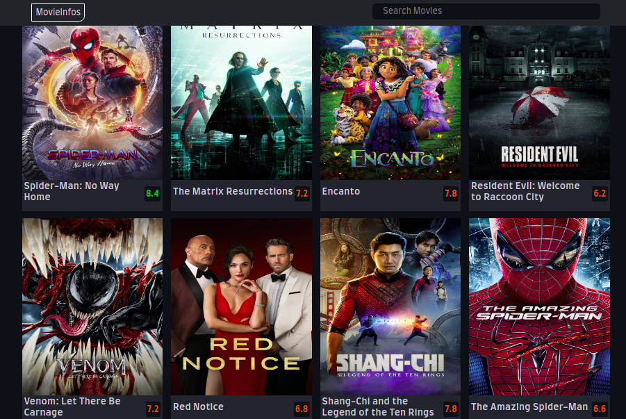

# # Movie Infos App

## Description

## Here, are: 

Mobile version | Desktop
---------------------- | ------------------------------
 | 

> Movie Infos App is a web page that, not only, can help you to track every movie and informations  about the movie but, also it can help you be updated about popular and new movies.
## Built With

- HTML
- CSS
- JavaScript
- Boostrap

## Get Started

To get a local copy up and running follow these simple example steps.

1. Clone the Repo or Download the Zip file or ``` https://github.com/tresorsawasawa/Movie-App ```.
2. ``` cd /Movie-App```
3. Open it with the live server

## Live Demo

See the live by clicking [Live Demo Link](https://tresorsawasawa.github.io/Movie-App/)

## Authors

👤 **Author**

- GitHub: [@tresorsawasawa](https://github.com/tresorsawasawa)
- Twitter: [@tresorsawasawa](https://twitter.com/TresorSawasawa)
- LinkedIn: [Trésor Sawasawa](https://www.linkedin.com/in/tresor-sawasawa/)

## 🤝 Contributing

Contributions, issues, and feature requests are welcome!

Feel free to check the [issues page](../../issues/).

## Show your support

Give a ⭐️ if you like this project!

## Acknowledgments

- Thanks to everyone who will get time to check this code and sugest any [issue](https://github.com/tresorsawasawa/MyPortfolio/issues) to improve the page.

## 📝 License

This project is [MIT](./MIT.md) licensed.

